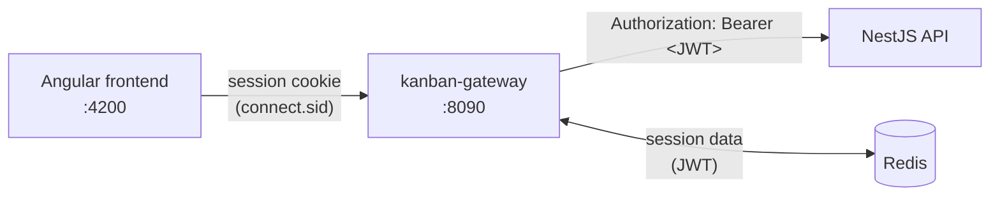
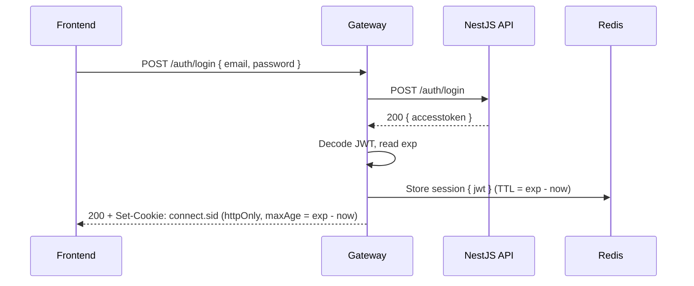
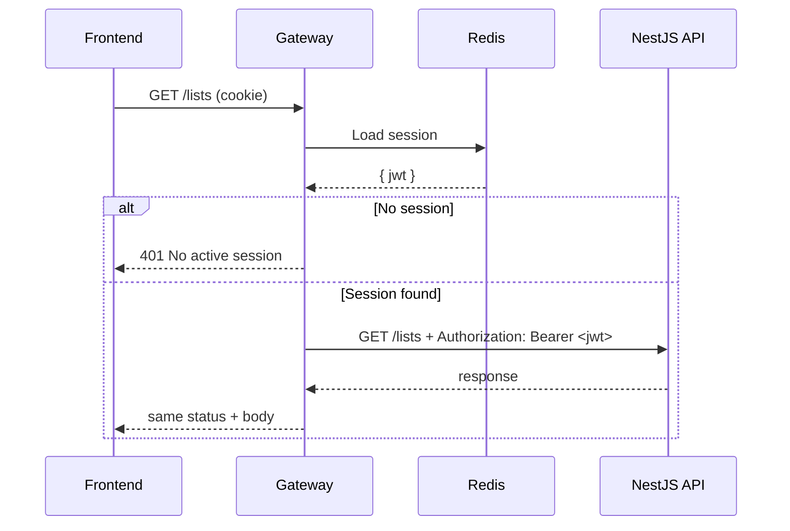
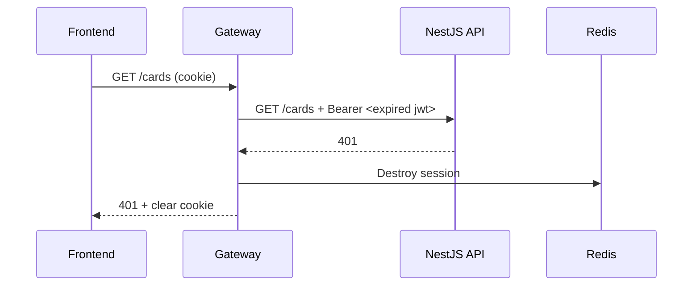
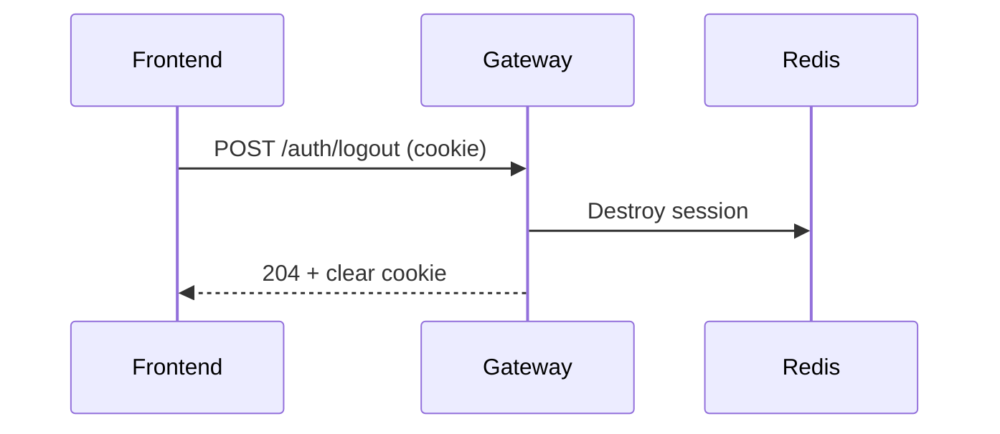

# kanban-gateway

Backend-for-Frontend (BFF) for the Kanban application. The gateway sits between the Angular frontend and the NestJS API: it manages user sessions in Redis and forwards authenticated requests to the API.

**The JWT never reaches the browser.** The frontend only holds an `httpOnly` session cookie; the token stays server-side in Redis and is attached to upstream requests by the gateway.

## Architecture



| Component | Role |
| --- | --- |
| Angular frontend | UI. Sends every request with `withCredentials: true` so the session cookie is included. |
| kanban-gateway | Authenticates users against the API, stores the JWT in a Redis-backed session, proxies business requests. |
| Redis | Session store. Each session is a key whose TTL matches the JWT expiration. |
| NestJS API | Business logic and data. Issues and verifies JWTs. |

## Data flows

### Login



The session lifetime is aligned on the JWT `exp` claim, so the cookie, the Redis key and the token all expire at the same time. The gateway only *decodes* the token (no signature check): it trusts the token because it received it directly from the API, and uses it solely to set the session duration.

### Proxied request



The upstream status code and body are forwarded as-is. Public paths (`/auth/register`) are forwarded without an `Authorization` header and don't require a session.

### Expired or revoked token



If the API rejects the token, the gateway destroys the session so the frontend never stays in a "looks logged in but nothing works" state.

### Logout



## Endpoints

### Handled by the gateway

| Method | Path | Description | Responses |
| --- | --- | --- | --- |
| `POST` | `/auth/login` | Authenticates against the API and opens a session | `200`, `400` validation, `401` invalid credentials, `502` API unavailable |
| `POST` | `/auth/logout` | Destroys the session and clears the cookie | `204` |

`/auth/login` body is validated before reaching the API: `email` must be a valid email, `password` a string of at least 8 characters.

### Proxied to the API

| Path | Session required |
| --- | --- |
| `/lists`, `/lists/*` | Yes |
| `/cards`, `/cards/*` | Yes |
| `/users`, `/users/*` | Yes |
| `/auth/register` | No |

All HTTP methods are forwarded, along with the body and query string. If the API cannot be reached, the gateway answers `502 Bad Gateway`.

## Project structure

```
src/
├── auth/
│   ├── dto/login.dto.ts       # Login payload validation
│   ├── auth.controller.ts     # POST /auth/login, POST /auth/logout
│   ├── auth.service.ts        # Calls the API login endpoint
│   └── auth.module.ts
├── proxy/
│   ├── proxy.controller.ts    # Route matching, session check, 401 handling
│   ├── proxy.service.ts       # Forwards requests to the API with the JWT
│   └── proxy.module.ts
├── session/
│   ├── session.module.ts      # Redis client, express-session middleware
│   ├── session.service.ts     # Read/write JWT, session lifetime, destroy
│   └── session.types.ts       # SessionData typing
├── app.module.ts
└── main.ts                    # Bootstrap, CORS, validation, shutdown hooks
```

Everything related to sessions lives in `SessionModule`. Controllers never touch `req.session` directly; they go through `SessionService`.

## Configuration

Copy `.env.example` to `.env` and adjust the values.

| Variable | Required | Default | Description |
| --- | --- | --- | --- |
| `PORT` | No | `8090` | Gateway port |
| `NESTJS_API_URL` | **Yes** | – | API base URL, **including its global prefix** if any (e.g. `http://localhost:3000/api`). Request paths are appended to it as-is. |
| `SESSION_SECRET` | **Yes** | – | Secret used to sign the session cookie. The app refuses to start without it. |
| `SESSION_TTL` | No | `3600` | Default session lifetime in seconds. Overridden at login by the JWT expiration. |
| `REDIS_HOST` | No | `localhost` | Redis host |
| `REDIS_PORT` | No | `6379` | Redis port |
| `FRONTEND_URL` | No | `http://localhost:4200` | Allowed CORS origin |
| `NODE_ENV` | No | – | When set to `production`, the session cookie is sent over HTTPS only (`secure`). |

`.env.docker` holds the values used inside Docker Compose (service names instead of `localhost`).

## Getting started

### Requirements

- Node.js **20.19+** or **22.12+** (required by NestJS 12, whose packages are ESM-only)
- A running Redis instance
- The NestJS API running and reachable at `NESTJS_API_URL`

### Local development

```bash
npm install
npm run start:dev
```

### Docker

```bash
docker-compose up --build
```

## Security notes

- **No token in the browser.** The JWT is stored in Redis; JavaScript on the frontend can't read it, which removes the main XSS token-theft vector.
- **Session cookie:** `httpOnly`, `sameSite: strict`, `secure` in production.
- **Aligned lifetimes:** cookie, Redis key and JWT expire together.
- **Fail fast on config:** missing `SESSION_SECRET` or `NESTJS_API_URL` stops the app instead of running with insecure defaults.
- **Graceful shutdown:** in-flight requests are drained and the Redis connection is closed cleanly.

## Known limitations

- **No refresh token.** When the JWT expires (1h by default), the user has to log in again. A refresh flow would let the gateway renew the access token transparently.
- **Query strings** are rebuilt with `URLSearchParams`, which flattens nested or array parameters (`?a[b]=1`).
